<!-- README.md is generated from README.Rmd. Please edit that file -->

```{r, include = FALSE}
knitr::opts_chunk$set(
  collapse = TRUE,
  comment = "#>",
  fig.path = "man/figures/README-",
  out.width = "100%",
  message = FALSE,
  warning = FALSE
)
options(digits = 2)
ggplot2::theme_set(ggplot2::theme_minimal())
```

# iROCK: Shiny Application for the Reproducible Open Coding Kit (ROCK)

<!-- badges: start -->
`r badger::badge_cran_release("iROCK", "orange")` `r badger::badge_devel("jbryer/iROCK", "blue")` `r badger::badge_repostatus("Active")` 
<!-- badges: end -->


See the [ROCK](https://rock.science) website for more information on the ROCK standard for qualitative data analysis.

### Getting Started

To install the latest development version, use the following command in R:

```{r, eval=FALSE}
remotes::install_github('jbryer/iROCK')
```

Start the Shiny application:

```{r, eval=FALSE}
iROCK::iROCK('myROCK')
```

Alternatively, you can deply the iROCK Shiny application using your own projects by using the template below. 

```{r, eval=FALSE, file='inst/shiny/app.R'}
```

You can download the [daacs.csv](inst/test_data/daacs.csv) file to test the features and to follow the directions below.


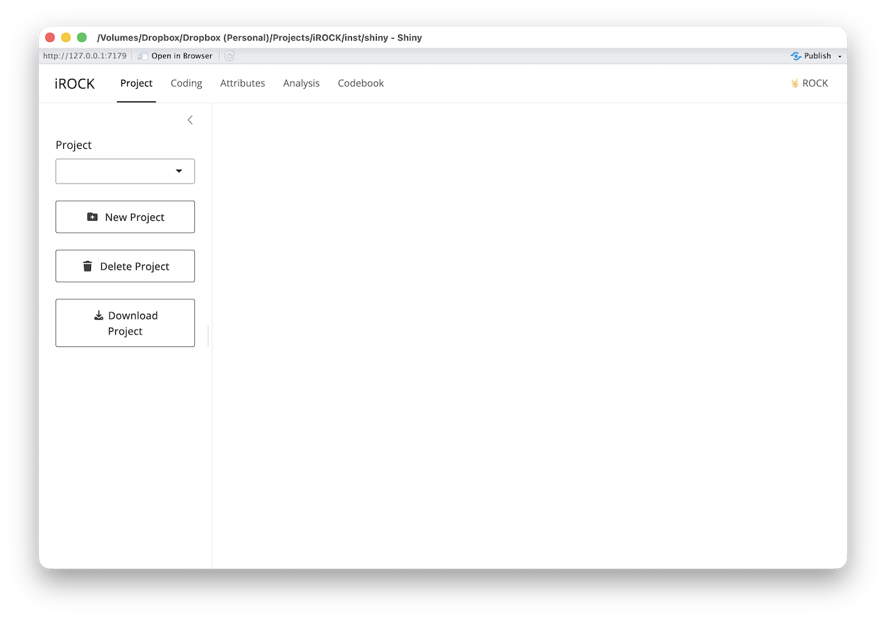

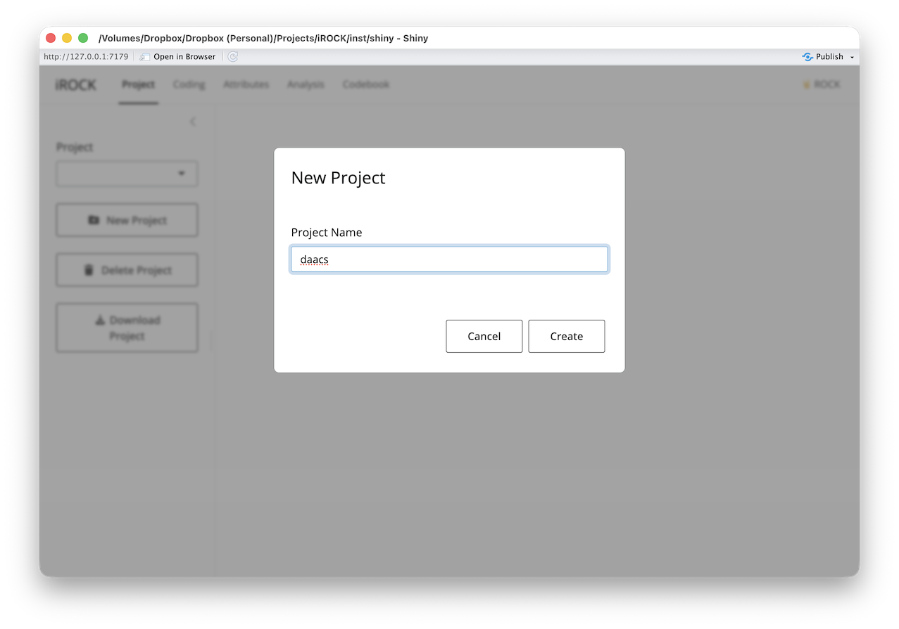

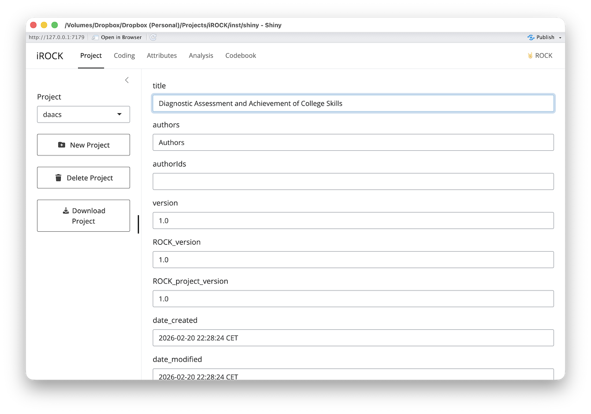

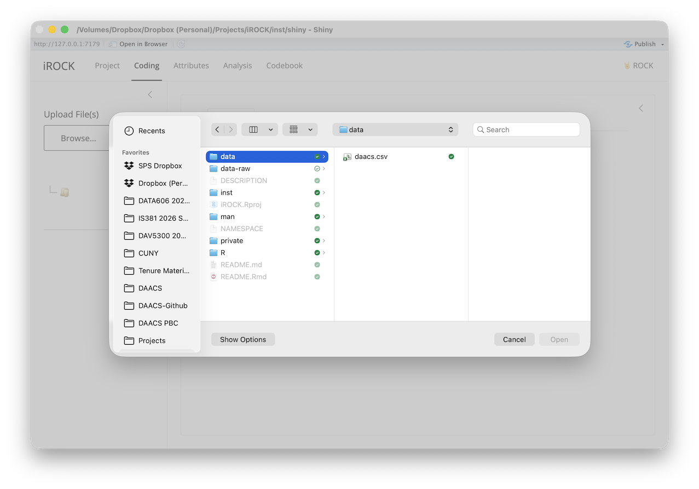

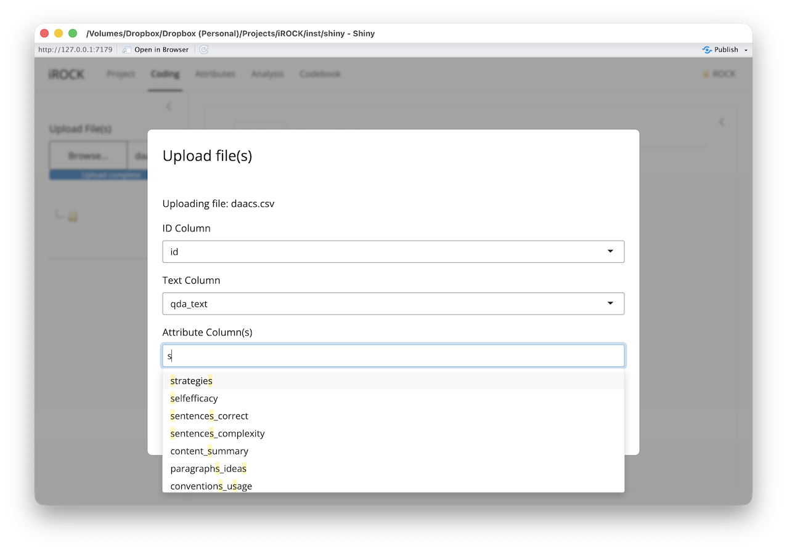

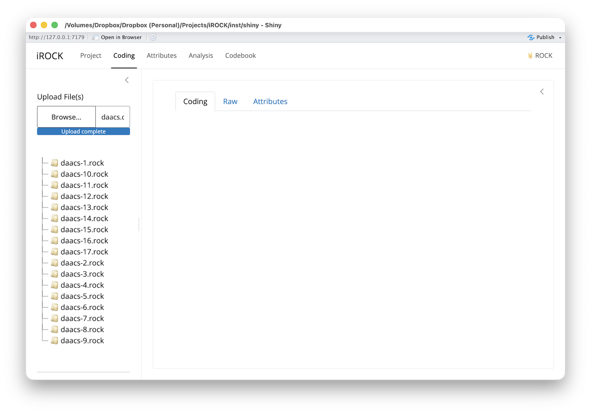

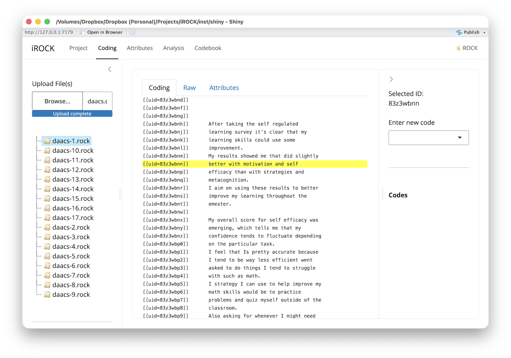

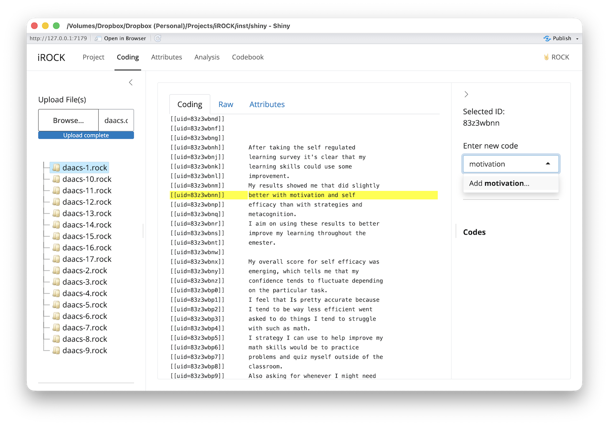

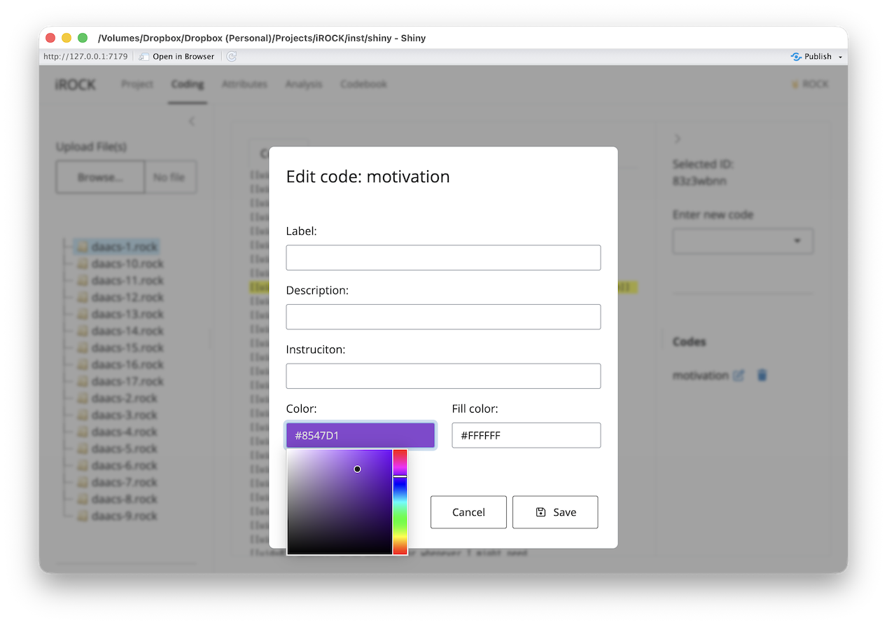

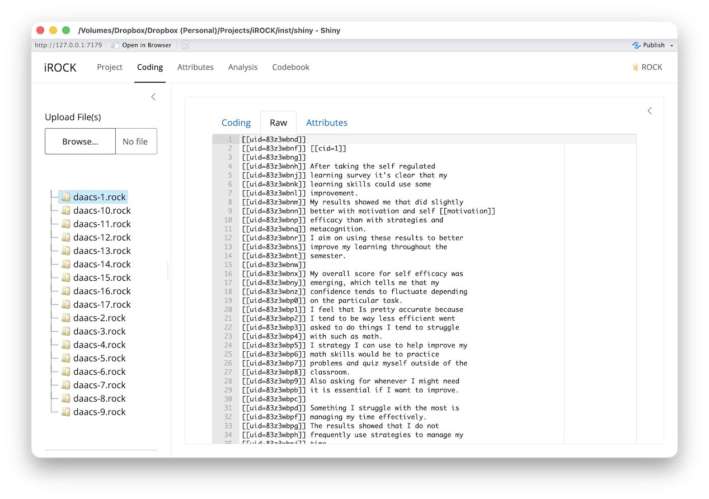

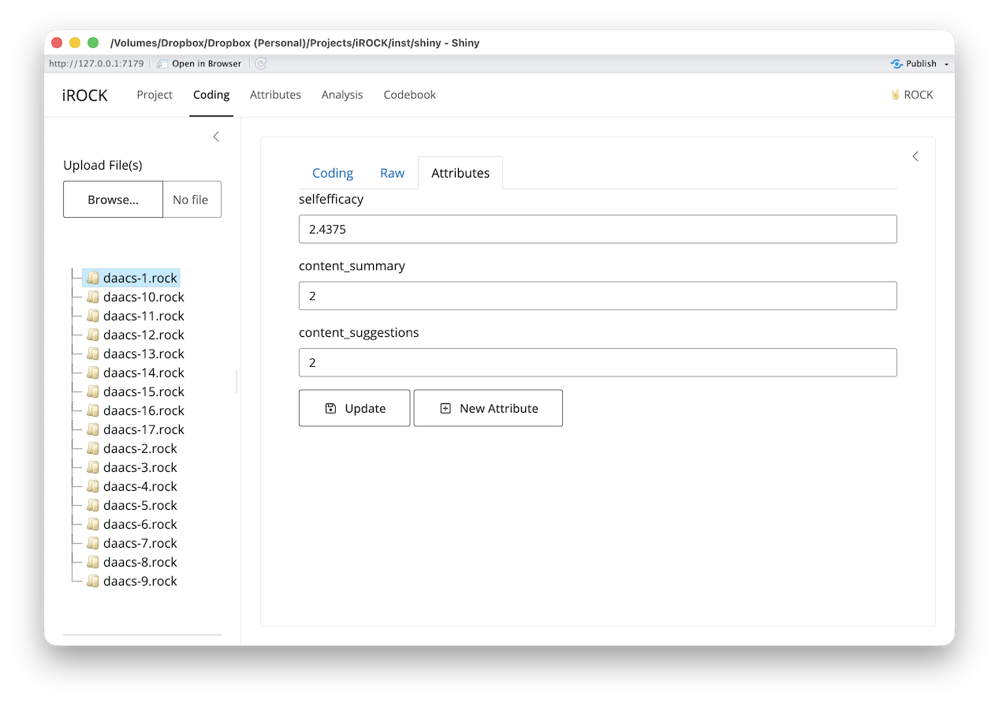

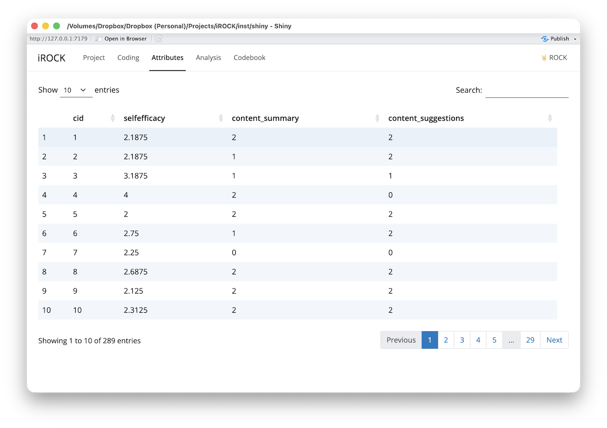

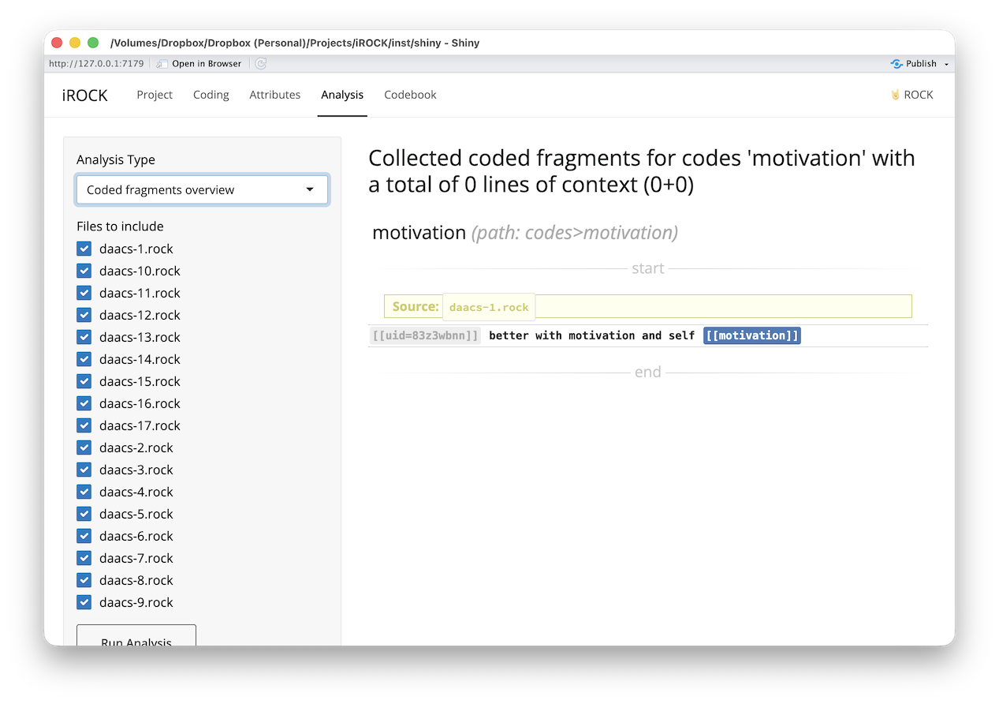

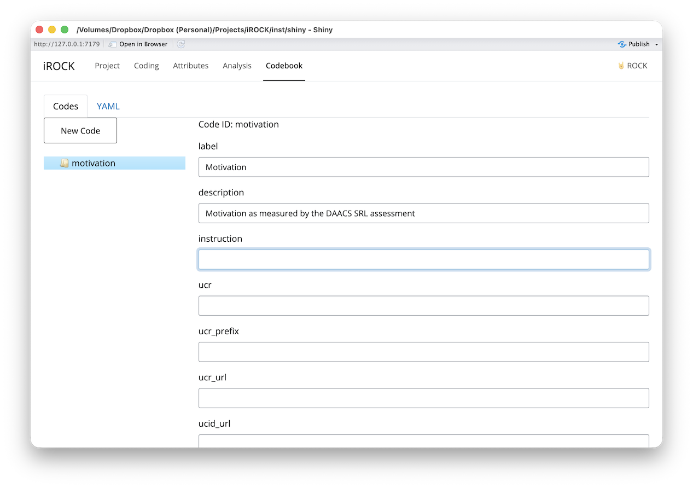

### Development

This R package is developed using `devtools`.

```{r, eval=FALSE}
devtools::document()
devtools::check_man()
devtools::install()
devtools::check(cran = TRUE)
```

